# Дипломное задание к курсу «Продвинутый JavaScript в браузере». Chaos Organizer
---
###### tags: `netology` `advanced js in html`

## Live Demo

Посетите [Live Demo]([URL_ВАШЕГО_ПРИЛОЖЕНИЯ](https://chaos-organizer.onrender.com)) для просмотра размещенного приложения.

Данные пользователя для доступа: 
 - name: test;
 - password: test1test1;

## Легенда

Мы всё больше привыкаем к неформальному формату организации информации, где ключевое — не структура, а удобство и поиск. Примеры: Slack, Telegram, WhatsApp, вплоть до помощников типа Siri или Алиса.

## Основная концепция

Ключевая идея — создать бота, предназначенного для хранения информации, поиска и других сервисов: напоминания, уведомления и интеграции с внешними сервисами.

Назовём это глобальным ботом-органайзером: вы закидывате туда всю информацию, которая вам нужна, а он сортирует, обеспечивает поиск, хранение и напоминание.

## Прототипы

В качестве прототипов для реализации была взята функциональность Telegram, WhatsApp, Slack и подобных мессенджеров. Только вместо живого собеседника у вас будет бот.

Скриншот Telegram:

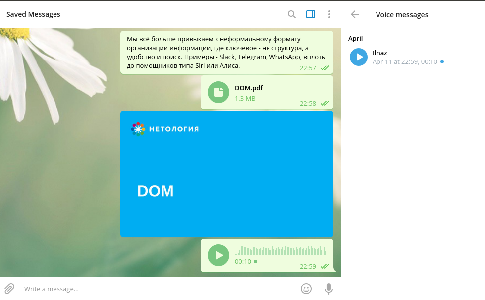

Скриншот WhatsApp:

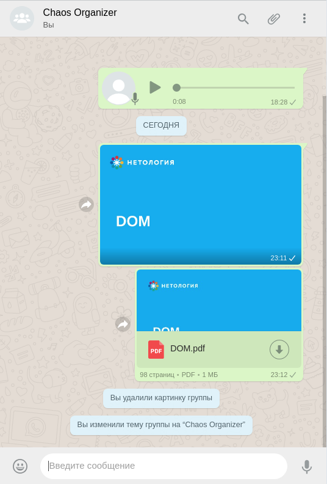

Скриншот Slack:

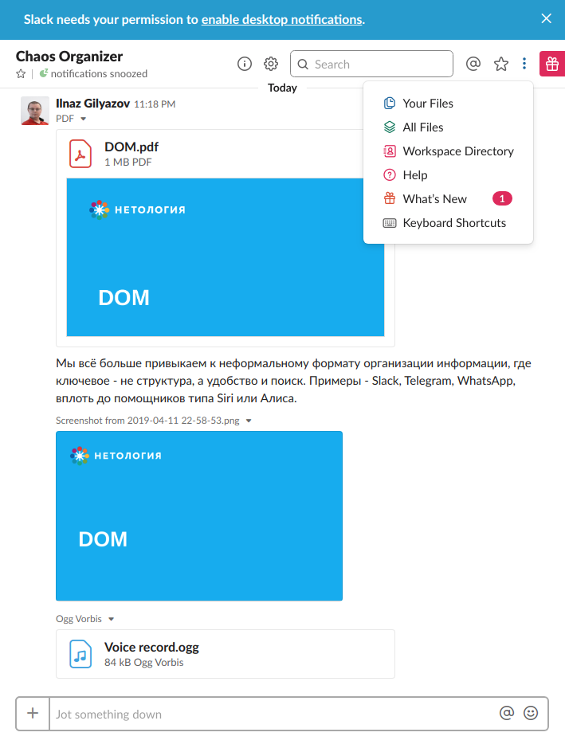

## Архитектура

Использовались Webpack, Babel, ESLint и AppVeyor для развёртывания.

## Ключевые функции

### Основные функции:

* сохранение в истории ссылок и текстовых сообщений, ссылки (`http://` или `https://`)кликабельны и отображаются, как ссылки;
  
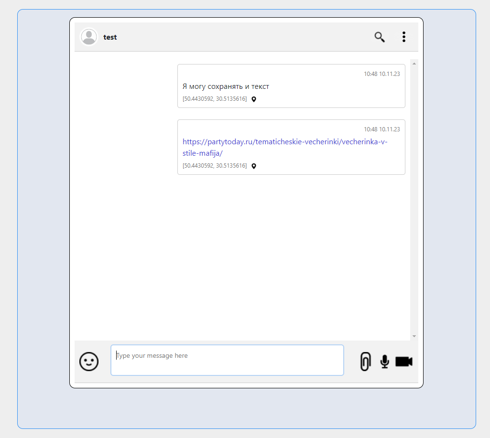

* сохранение в истории изображений, видео и аудио (как файлов) — через Drag & Drop и через иконку загрузки;

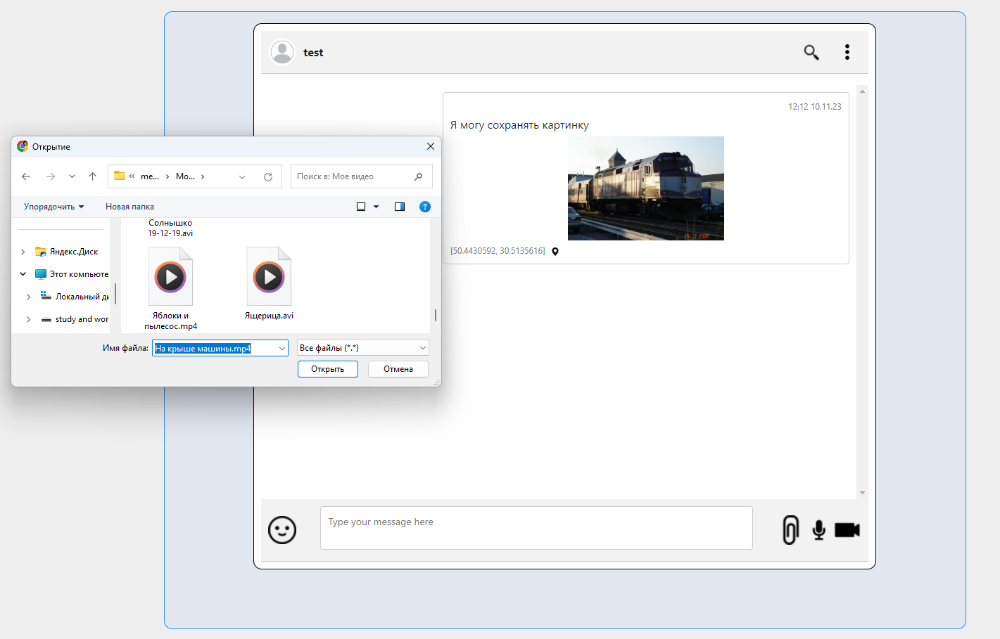

* скачивание файлов на компьютер пользователя;

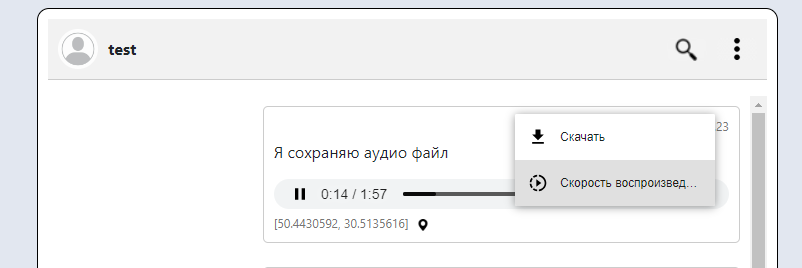

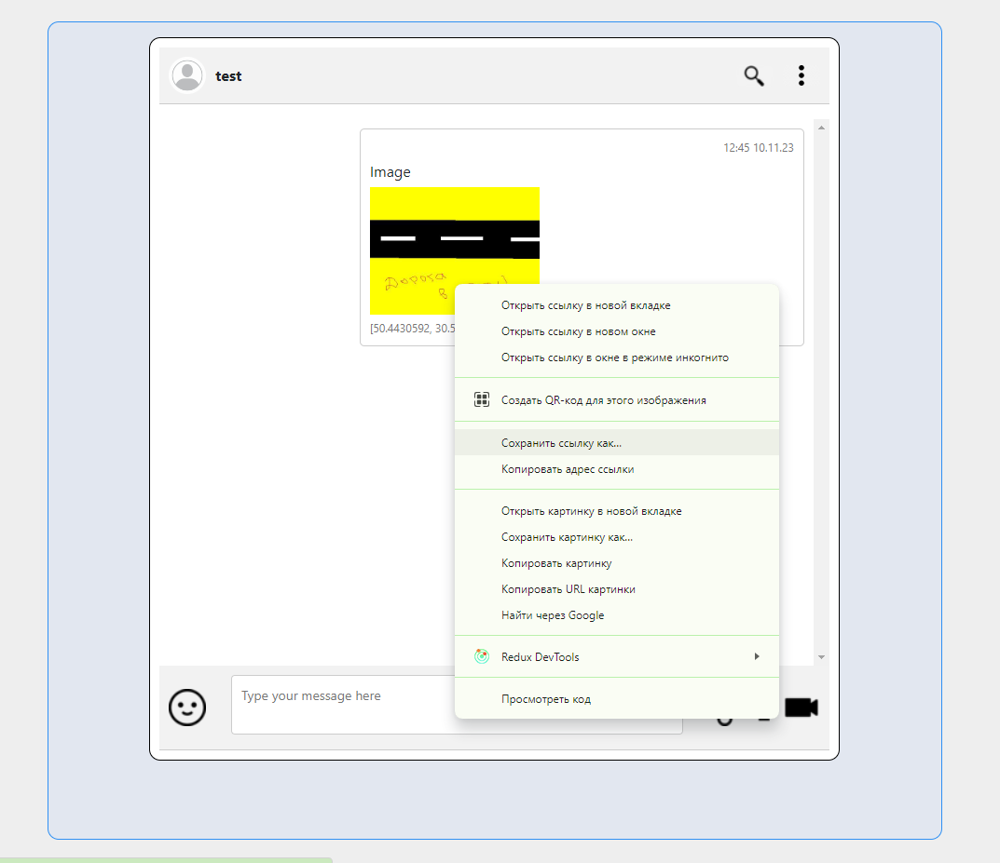

* ленивая подгрузка: сначала подгружаются последние 10 сообщений, при прокрутке вверх подгружаются следующие 10 и т. д.

### Дополнительные функции:

* синхронизация: если приложение открыто в нескольких окнах или вкладках, то контент синхронизирован;

* поиск по сообщениям (интерфейс + реализация на сервере);

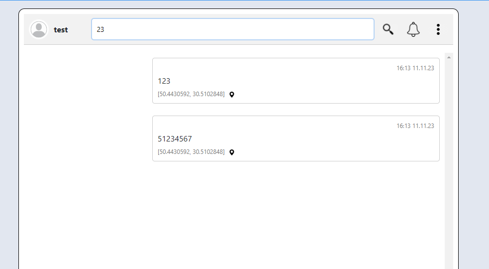

* запись видео и аудио, используя API браузера;

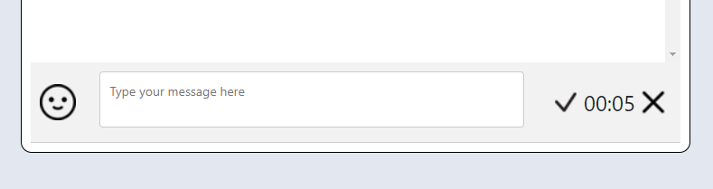

* отправка геолокации в ручном режиме или используя API браузера;

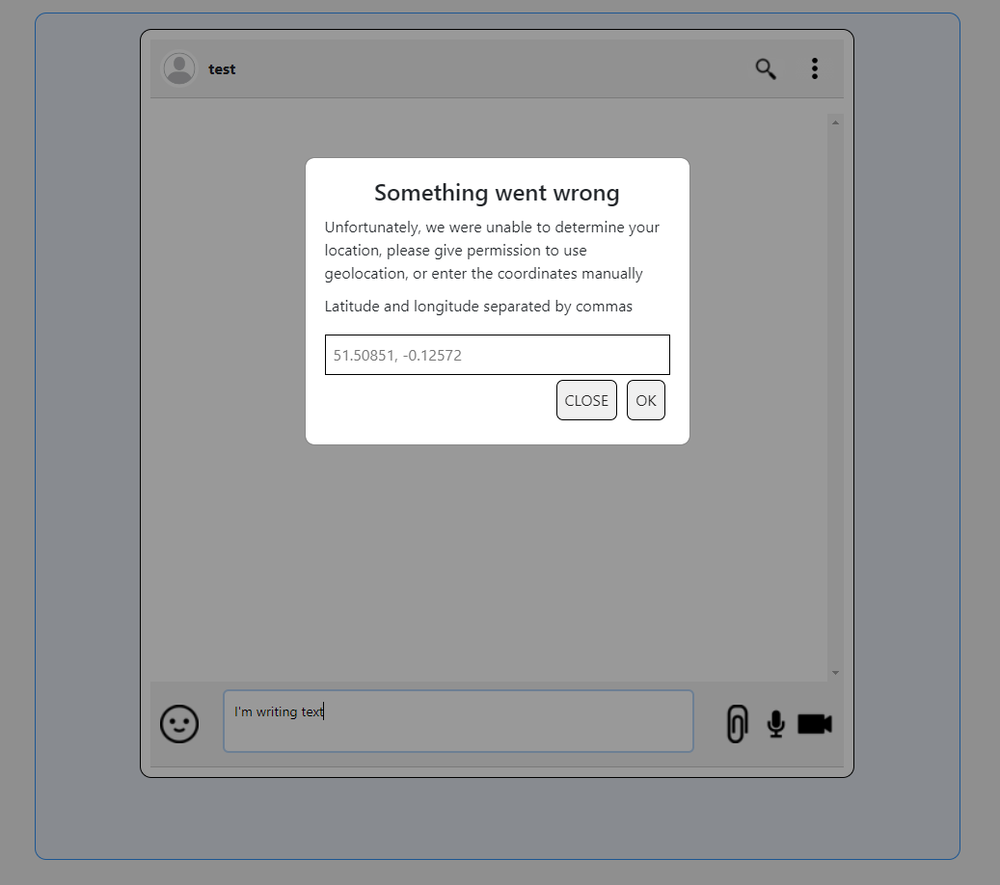

* воспроизведение видео/аудио, используя API браузера;

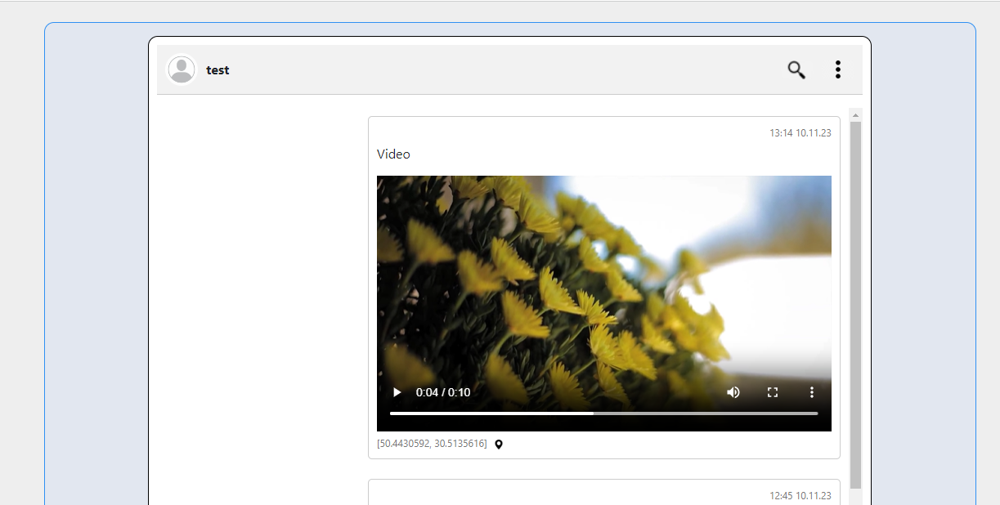

* установка напоминаний и напоминания через Notification API: `@schedule: 18:04 31.08.2019 «Последний день лета»`;

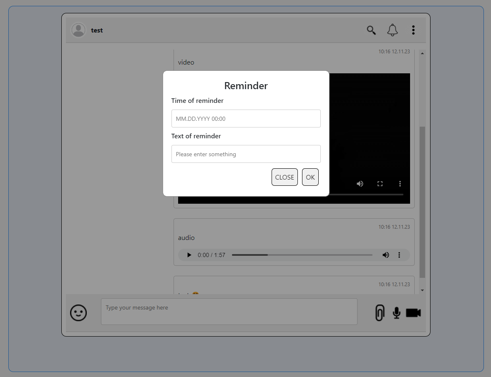

* просмотр вложений по категориям: аудио, видео, изображения, другие файлы (см. боковое меню);

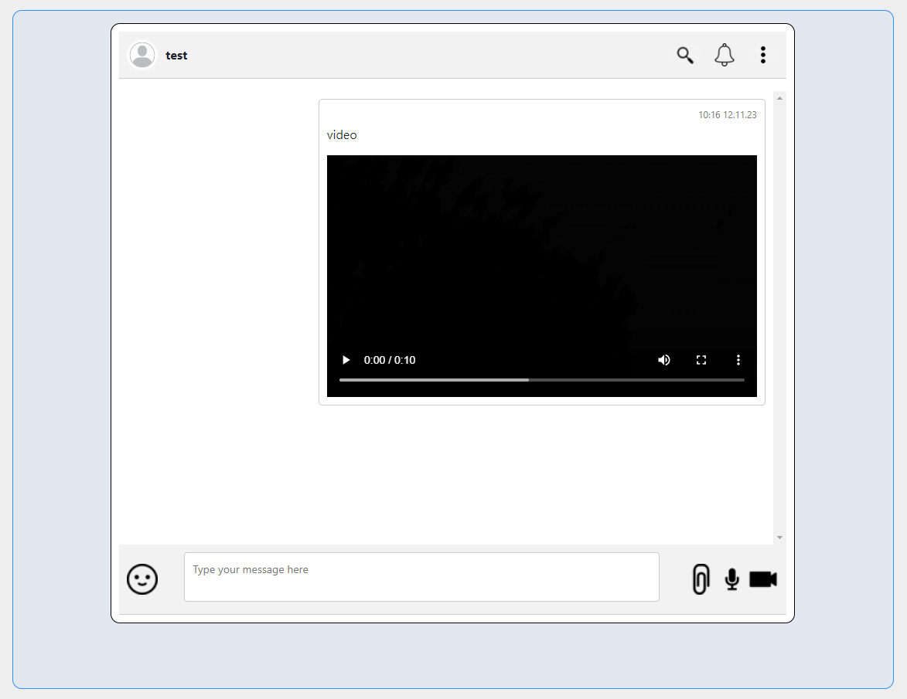

* поддержка смайликов (emoji);

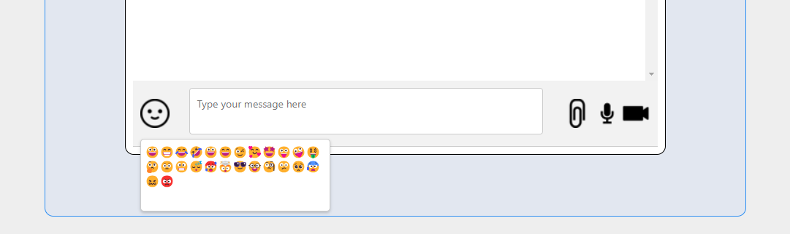

